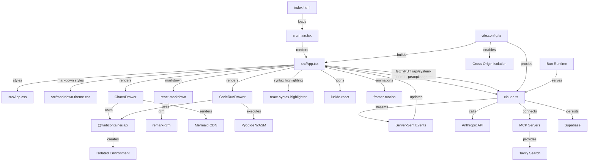

# Thermodynamic Agentic Research Agent - Codebase Cartography

## Executive Summary

**Project**: Thermodynamic - Advanced Agentic Research Agent with WebContainer Integration  
**Architecture**: Full-stack TypeScript application with React frontend and Bun backend  
**Build System**: Vite 7.1.0 with React SWC plugin and cross-origin isolation  
**Current State**: Production-ready agentic research interface with Claude integration, WebContainer-based code execution, and Mermaid diagram rendering  

The codebase implements a sophisticated agentic research agent featuring a React-based chat interface that communicates with Claude via Anthropic's API. The system supports streaming responses, tool usage, MCP server integration, real-time console logging, WebContainer-based code execution, automatic Mermaid diagram rendering, and persistent system prompt management via Supabase. The application uses a dual-server architecture with Vite handling frontend development and Bun serving the API backend.

## Component Inventory

### Frontend Components
- [`src/App.tsx`](src/App.tsx:1-417) - Main application component (417 lines)
  - Chat interface with streaming message support
  - Real-time console log ticker display
  - Auto-resizing textarea with keyboard shortcuts
  - Markdown rendering with GitHub Flavored Markdown support
  - Microphone toggle functionality (UI only)
  - Settings drawer with persistent system prompt management
  - Auto-detection and rendering of Mermaid diagrams
  - Code execution buttons for JavaScript, HTML, and Python
  - WebContainer integration management

- [`src/components/ChartsDrawer.tsx`](src/components/ChartsDrawer.tsx:1-267) - WebContainer-based Mermaid renderer (267 lines)
  - Cross-origin isolated WebContainer environment
  - Dynamic Mermaid diagram rendering via CDN
  - Live code updates with cache-busting
  - Embedded HTTP server for diagram serving
  - Error handling for WebContainer initialization

- [`src/components/CodeRunDrawer.tsx`](src/components/CodeRunDrawer.tsx:1-349) - WebContainer-based code execution (349 lines)
  - Multi-language support (JavaScript, HTML, Python via Pyodide)
  - Live code preview with console output capture
  - Sandboxed execution environment
  - Dynamic file generation based on language type
  - Real-time code synchronization

- [`src/main.tsx`](src/main.tsx:1-10) - React application entry point (10 lines)
  - Standard React 19.1.1 StrictMode setup
  - DOM mounting to root element

### Styling Components
- [`src/App.css`](src/App.css:1-173) - Application styling (173 lines)
  - Dark theme with grid-based layout
  - Fixed composer at bottom of viewport
  - Responsive design with mobile considerations
  - Console log ticker styling with monospace font
  - Drawer system styling with backdrop blur
  - WebContainer iframe integration styles

- [`src/markdown-theme.css`](src/markdown-theme.css:1-90) - Markdown theming (90 lines)
  - Custom gradient headings with Poppins font
  - Syntax-highlighted code blocks with run buttons
  - Table styling with dark theme
  - Mermaid container styling
  - Link hover effects and blockquote styling

### Backend Components
- [`claude.ts`](claude.ts:1-320) - API server and Claude integration (320 lines)
  - Anthropic Claude API client with streaming support
  - MCP (Model Context Protocol) server integration
  - Custom tool definitions (stock price, weather, time, web search)
  - Bun HTTP server with SSE (Server-Sent Events) streaming
  - Environment-based configuration system
  - Supabase integration for system prompt persistence
  - Automatic streaming optimization based on prompt complexity

### Configuration Files
- [`package.json`](package.json:1-62) - Project dependencies and scripts (62 lines)
  - Concurrent development server setup
  - Comprehensive UI library stack (Radix, Tailwind, Framer Motion)
  - AI/research tooling (Anthropic SDK, Supabase, Tavily)
  - WebContainer API integration
  - Mermaid diagram rendering support

- [`vite.config.ts`](vite.config.ts:1-26) - Frontend build configuration (26 lines)
  - React SWC plugin for fast compilation
  - API proxy to backend server (localhost:3000)
  - Cross-origin isolation headers (COOP/COEP) for WebContainer support
  - WebSocket support for development

## Dependency Map



### External Dependencies
**Frontend UI Stack:**
- **React 19.1.1** - Core UI framework
- **@radix-ui/themes 3.2.1** - Design system components
- **Tailwind CSS 4.1.11** - Utility-first styling
- **Framer Motion 12.23.12** - Animation library
- **Lucide React 0.539.0** - Icon library
- **React Markdown 10.1.0** - Markdown rendering
- **React Syntax Highlighter 15.6.1** - Code syntax highlighting

**WebContainer & Execution Stack:**
- **@webcontainer/api 1.6.1** - Browser-based Node.js environment
- **Mermaid 11.9.0** - Diagram rendering (CDN-loaded)
- **Pyodide 0.26.2** - Python in WebAssembly (CDN-loaded)

**Backend & AI Stack:**
- **@anthropic-ai/sdk 0.59.0** - Claude API client
- **@supabase/supabase-js 2.54.0** - Database client for system prompt persistence
- **Tavily 1.0.2** - Web search integration
- **Tavily MCP 0.2.9** - MCP server for web search

### Development Dependencies
- **Vite 7.1.0** - Build tool and dev server
- **TypeScript 5.9.2** - Type system
- **ESLint 9.32.0** - Code linting
- **Concurrently 9.2.0** - Multi-process development

## Data Flow Documentation

### Request Flow
1. **User Input**: [`src/App.tsx:118-189`](src/App.tsx:118-189) - User types message and presses Enter
2. **API Request**: POST to `/api/message` with JSON payload `{text: string}`
3. **Backend Processing**: [`claude.ts:263-317`](claude.ts:263-317) - Bun server receives request
4. **System Prompt Integration**: [`claude.ts:266-272`](claude.ts:266-272) - Loads cached system prompt from Supabase
5. **Claude Integration**: [`claude.ts:273-279`](claude.ts:273-279) - Anthropic API streaming call with 1-hour prompt caching
6. **Response Streaming**: Server-Sent Events stream back to frontend
7. **UI Updates**: Real-time markdown rendering, console log updates, and auto-detection of Mermaid/code blocks

### State Management
- **Local React State**: [`src/App.tsx:17-34`](src/App.tsx:17-34)
  - `input` - Current user input text
  - `markdown` - Accumulated conversation history
  - `isLoading` - Request processing state
  - `logs` - Console log history (max 30 items)
  - `micOn` - Microphone toggle state (UI only)
  - `drawerOpen` - Settings drawer visibility
  - `chartsOpen` - Charts drawer visibility
  - `chartsCode` - Current Mermaid diagram code
  - `runOpen` - Code execution drawer visibility
  - `runCode` - Current code to execute
  - `runLang` - Programming language for execution
  - `systemPrompt` - Persistent system prompt text
  - `saving` - System prompt save state

### WebContainer Integration Flow
1. **Mermaid Detection**: [`src/App.tsx:49-58`](src/App.tsx:49-58) - Auto-detects Mermaid blocks in markdown
2. **WebContainer Boot**: [`src/components/ChartsDrawer.tsx:27-95`](src/components/ChartsDrawer.tsx:27-95) - Initializes isolated environment
3. **File Synchronization**: Dynamic file writing based on content type
4. **Live Rendering**: Real-time updates with cache-busting URLs

### Console Logging System
- **Log Capture**: [`src/App.tsx:39-46`](src/App.tsx:39-46) - Intercepts console methods
- **Log Display**: [`src/App.tsx:286-294`](src/App.tsx:286-294) - Ticker-style log display
- **Log Types**: Supports `log`, `warn`, and `error` levels with visual differentiation

## Integration Documentation

### API Endpoints
- **POST `/api/message`** - Main chat endpoint
  - Input: `{text: string}`
  - Output: Server-Sent Events stream
  - Content-Type: `text/event-stream`

- **GET `/api/system-prompt`** - Retrieve current system prompt
  - Output: `{prompt: string}`
  - Cached locally and in Supabase

- **PUT `/api/system-prompt`** - Update system prompt
  - Input: `{prompt: string}`
  - Persisted to Supabase with local caching

### External Service Connections
- **Anthropic Claude API** - Primary AI model integration
  - Model: `claude-sonnet-4-20250514`
  - Max tokens: 64,000
  - Temperature: 1.0
  - Streaming enabled with tool support
  - 1-hour ephemeral prompt caching

- **Supabase Integration** - [`claude.ts:189-236`](claude.ts:189-236)
  - System prompt persistence via `app_settings` table
  - Service role authentication
  - Graceful fallback to local caching

- **MCP Server Integration** - [`claude.ts:13-32`](claude.ts:13-32)
  - Configurable via `MCP_SERVER_URL` environment variable
  - Fallback to Tavily MCP if `TAVILY_API_KEY` provided
  - OAuth bearer token support via `MCP_AUTH_TOKEN`

### WebContainer Services
- **Cross-Origin Isolation**: [`vite.config.ts:8-11`](vite.config.ts:8-11) - Required COOP/COEP headers
- **Mermaid Rendering**: CDN-based Mermaid 11.9.0 with dark theme
- **Python Execution**: Pyodide 0.26.2 WASM runtime
- **JavaScript Execution**: Native browser module execution

### Custom Tools Available
- **get_stock_price** - Stock ticker price lookup
- **get_weather** - Weather information by location
- **get_time** - Current time by location
- **web_search** - Web search via Anthropic's built-in capability

### Build and Deployment
- **Development**: `bun run dev` - Concurrent frontend/backend servers with cross-origin isolation
- **Production Build**: `bun run build` - TypeScript compilation + Vite build
- **API Server**: `bun run api` - Standalone backend server
- **Frontend Only**: `bun run web` - Vite development server

## Modularization Observations

### Current Architecture State
- **Monolithic Frontend**: App component handles multiple concerns (417 lines) including UI, API communication, state management, WebContainer orchestration, and drawer management
- **Backend Consolidation**: All API logic contained in single `claude.ts` file (320 lines) with system prompt persistence, streaming, and tool integration
- **Component Separation**: WebContainer functionality properly separated into dedicated drawer components
- **Configuration Separation**: Proper separation of build, TypeScript, and package configurations
- **Styling Organization**: Component-specific CSS with comprehensive theming system

### Structural Observations
- **WebContainer Integration**: Sophisticated browser-based execution environment with proper isolation and security headers
- **Real-time Features**: Efficient Server-Sent Events implementation with streaming optimization
- **Persistent Storage**: Supabase integration for system prompt persistence with local caching fallback
- **Auto-detection Systems**: Automatic Mermaid diagram detection and code execution button injection
- **Cross-Origin Isolation**: Proper implementation of security headers required for WebContainer SharedArrayBuffer usage

### Performance Considerations
- **Streaming Optimization**: [`claude.ts:34-162`](claude.ts:34-162) - Automatic streaming toggle based on prompt complexity
- **WebContainer Caching**: Global WebContainer instance reuse across drawer sessions
- **Prompt Caching**: [`claude.ts:67-71`](claude.ts:67-71) - 1-hour ephemeral cache for system prompts
- **Auto-resize Logic**: [`src/App.tsx:62-74`](src/App.tsx:62-74) - Dynamic textarea sizing with performance optimizations
- **Log Management**: [`src/App.tsx:404`](src/App.tsx:404) - Automatic log history truncation (30 items max)
- **Cache Busting**: [`src/components/ChartsDrawer.tsx:177-182`](src/components/ChartsDrawer.tsx:177-182) - URL-based cache invalidation for live updates

## Quick Reference

### Development Commands
```bash
bun install              # Install all dependencies
bun run dev             # Start both frontend and backend servers with cross-origin isolation
bun run web             # Frontend development server only
bun run api             # Backend API server only
bun run build           # Production build
bun run preview         # Preview production build with cross-origin isolation
bun run lint            # Run ESLint checks
```

### Environment Variables
```bash
ANTHROPIC_API_KEY       # Required: Claude API access
MCP_SERVER_URL          # Optional: Custom MCP server endpoint
MCP_SERVER_NAME         # Optional: MCP server name (default: "tavily")
MCP_AUTH_TOKEN          # Optional: MCP server authentication
TAVILY_API_KEY          # Optional: Tavily search integration (enables fallback MCP)
SUPABASE_URL            # Optional: Supabase project URL for system prompt persistence
SUPABASE_SERVICE_ROLE   # Optional: Supabase service role key
PORT                    # Optional: Backend server port (default: 3000)
STREAMING               # Optional: Enable/disable streaming (default: true)
STREAMING_AUTO          # Optional: Auto-disable streaming for short prompts (default: true)
STREAMING_AUTO_CHAR_LIMIT # Optional: Character limit for auto-streaming toggle (default: 500)
VITE_WEB_CONTAINERS_CLIENT_ID # Optional: WebContainers authentication client ID
```

### Key Files for Understanding
1. [`src/App.tsx`](src/App.tsx) - Frontend interface, user interaction logic, and WebContainer orchestration
2. [`src/components/ChartsDrawer.tsx`](src/components/ChartsDrawer.tsx) - Mermaid diagram rendering via WebContainer
3. [`src/components/CodeRunDrawer.tsx`](src/components/CodeRunDrawer.tsx) - Multi-language code execution environment
4. [`claude.ts`](claude.ts) - Backend API server, Claude integration, and system prompt persistence
5. [`package.json`](package.json) - Project dependencies and development scripts
6. [`vite.config.ts`](vite.config.ts) - Frontend build configuration with cross-origin isolation

### Naming Conventions
- **Components**: PascalCase React functional components
- **Files**: kebab-case for configs, PascalCase for React components
- **CSS Classes**: BEM-style naming with double underscores and hyphens
- **API Endpoints**: RESTful `/api/` prefix with descriptive paths
- **WebContainer Globals**: `__MERMAID_WC__` and `__RUN_WC__` for instance caching

### Development Setup Requirements
- **Runtime**: Bun (evidenced by bun.lock and Bun.serve usage)
- **Node Version**: Compatible with React 19 and TypeScript 5.9
- **API Keys**: Anthropic API key required for functionality
- **Browser**: Modern browser with ES modules, Server-Sent Events, and SharedArrayBuffer support
- **Cross-Origin Isolation**: Required for WebContainer functionality (automatically configured)
- **Optional Services**: Supabase for system prompt persistence, Tavily for enhanced search

---

**Documentation Generated**: 2025-01-09  
**Codebase State**: Production-ready agentic research agent with WebContainer integration and advanced features  
**Total Files Analyzed**: 20 core files  
**Lines of Code**: ~1,400 lines (excluding dependencies and generated files)  
**Architecture Pattern**: Full-stack TypeScript with React frontend, Bun backend, and WebContainer-based execution environments