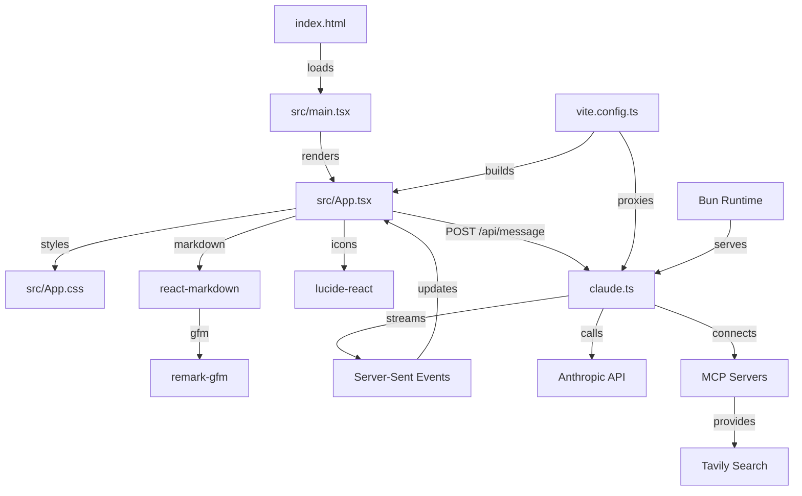

# Thermodynamic Agentic Research Agent - Codebase Cartography

## Executive Summary

**Project**: Thermodynamic - Agentic Research Agent  
**Architecture**: Full-stack TypeScript application with React frontend and Bun backend  
**Build System**: Vite 7.1.0 with React SWC plugin  
**Current State**: Production-ready agentic research interface with Claude integration  

The codebase implements a sophisticated agentic research agent featuring a React-based chat interface that communicates with Claude via Anthropic's API. The system supports streaming responses, tool usage, MCP server integration, and real-time console logging. The application uses a dual-server architecture with Vite handling frontend development and Bun serving the API backend.

## Component Inventory

### Frontend Components
- [`src/App.tsx`](src/App.tsx:1-159) - Main application component (159 lines)
  - Chat interface with streaming message support
  - Real-time console log ticker display
  - Auto-resizing textarea with keyboard shortcuts
  - Markdown rendering with GitHub Flavored Markdown support
  - Microphone toggle functionality (UI only)

- [`src/main.tsx`](src/main.tsx:1-10) - React application entry point (10 lines)
  - Standard React 19.1.1 StrictMode setup
  - DOM mounting to root element

- [`src/App.css`](src/App.css:1-108) - Application styling (108 lines)
  - Dark theme with grid-based layout
  - Fixed composer at bottom of viewport
  - Responsive design with mobile considerations
  - Console log ticker styling with monospace font

### Backend Components
- [`claude.ts`](claude.ts:1-242) - API server and Claude integration (242 lines)
  - Anthropic Claude API client with streaming support
  - MCP (Model Context Protocol) server integration
  - Custom tool definitions (stock price, weather, time, web search)
  - Bun HTTP server with SSE (Server-Sent Events) streaming
  - Environment-based configuration system

### Configuration Files
- [`package.json`](package.json:1-58) - Project dependencies and scripts (58 lines)
  - Concurrent development server setup
  - Comprehensive UI library stack (Radix, Tailwind, Framer Motion)
  - AI/research tooling (Anthropic SDK, Supabase, Tavily)

- [`vite.config.ts`](vite.config.ts:1-16) - Frontend build configuration (16 lines)
  - React SWC plugin for fast compilation
  - API proxy to backend server (localhost:3000)
  - WebSocket support for development

## Dependency Map



### External Dependencies
**Frontend UI Stack:**
- **React 19.1.1** - Core UI framework
- **@radix-ui/themes 3.2.1** - Design system components
- **Tailwind CSS 4.1.11** - Utility-first styling
- **Framer Motion 12.23.12** - Animation library
- **Lucide React 0.539.0** - Icon library

**Backend & AI Stack:**
- **@anthropic-ai/sdk 0.59.0** - Claude API client
- **@supabase/supabase-js 2.54.0** - Database client
- **Tavily 1.0.2** - Web search integration
- **Mermaid 11.9.0** - Diagram rendering

### Development Dependencies
- **Vite 7.1.0** - Build tool and dev server
- **TypeScript 5.9.2** - Type system
- **ESLint 9.32.0** - Code linting
- **Concurrently 9.2.0** - Multi-process development

## Data Flow Documentation

### Request Flow
1. **User Input**: [`src/App.tsx:45-86`](src/App.tsx:45-86) - User types message and presses Enter
2. **API Request**: POST to `/api/message` with JSON payload `{text: string}`
3. **Backend Processing**: [`claude.ts:193-241`](claude.ts:193-241) - Bun server receives request
4. **Claude Integration**: [`claude.ts:196-201`](claude.ts:196-201) - Anthropic API streaming call
5. **Response Streaming**: Server-Sent Events stream back to frontend
6. **UI Updates**: Real-time markdown rendering and console log updates

### State Management
- **Local React State**: [`src/App.tsx:10-16`](src/App.tsx:10-16)
  - `input` - Current user input text
  - `markdown` - Accumulated conversation history
  - `isLoading` - Request processing state
  - `logs` - Console log history (max 30 items)
  - `micOn` - Microphone toggle state (UI only)

### Console Logging System
- **Log Capture**: [`src/App.tsx:19-25`](src/App.tsx:19-25) - Intercepts console methods
- **Log Display**: [`src/App.tsx:112-120`](src/App.tsx:112-120) - Ticker-style log display
- **Log Types**: Supports `log`, `warn`, and `error` levels with visual differentiation

## Integration Documentation

### API Endpoints
- **POST `/api/message`** - Main chat endpoint
  - Input: `{text: string}`
  - Output: Server-Sent Events stream
  - Content-Type: `text/event-stream`

### External Service Connections
- **Anthropic Claude API** - Primary AI model integration
  - Model: `claude-sonnet-4-20250514`
  - Max tokens: 64,000
  - Temperature: 1.0
  - Streaming enabled with tool support

- **MCP Server Integration** - [`claude.ts:12-31`](claude.ts:12-31)
  - Configurable via `MCP_SERVER_URL` environment variable
  - Fallback to Tavily MCP if `TAVILY_API_KEY` provided
  - OAuth bearer token support via `MCP_AUTH_TOKEN`

### Custom Tools Available
- **get_stock_price** - Stock ticker price lookup
- **get_weather** - Weather information by location
- **get_time** - Current time by location
- **web_search** - Web search via Anthropic's built-in capability

### Build and Deployment
- **Development**: `bun run dev` - Concurrent frontend/backend servers
- **Production Build**: `bun run build` - TypeScript compilation + Vite build
- **API Server**: `bun run api` - Standalone backend server
- **Frontend Only**: `bun run web` - Vite development server

## Modularization Observations

### Current Architecture State
- **Single-File Components**: Frontend uses monolithic App component (159 lines)
- **Backend Consolidation**: All API logic contained in single `claude.ts` file (242 lines)
- **Configuration Separation**: Proper separation of build, TypeScript, and package configurations
- **Styling Organization**: Component-specific CSS with global variables

### Structural Observations
- **Frontend Modularity**: App component handles multiple concerns (UI, API communication, state management, logging)
- **Backend Modularity**: Claude integration combines server setup, API client, tool definitions, and streaming logic
- **Environment Configuration**: Comprehensive environment variable system for API keys and server URLs
- **Development Workflow**: Well-structured concurrent development setup with proper proxy configuration

### Performance Considerations
- **Streaming Implementation**: Efficient Server-Sent Events for real-time response delivery
- **Auto-resize Logic**: [`src/App.tsx:31-43`](src/App.tsx:31-43) - Dynamic textarea sizing with performance optimizations
- **Log Management**: [`src/App.tsx:157`](src/App.tsx:157) - Automatic log history truncation (30 items max)
- **Prompt Caching**: [`claude.ts:66-71`](claude.ts:66-71) - 1-hour ephemeral cache for system prompts

## Quick Reference

### Development Commands
```bash
bun install              # Install all dependencies
bun run dev             # Start both frontend and backend servers
bun run web             # Frontend development server only
bun run api             # Backend API server only
bun run build           # Production build
bun run preview         # Preview production build
bun run lint            # Run ESLint checks
```

### Environment Variables
```bash
ANTHROPIC_API_KEY       # Required: Claude API access
MCP_SERVER_URL          # Optional: Custom MCP server endpoint
MCP_SERVER_NAME         # Optional: MCP server name (default: "tavily")
MCP_AUTH_TOKEN          # Optional: MCP server authentication
TAVILY_API_KEY          # Optional: Tavily search integration
PORT                    # Optional: Backend server port (default: 3000)
STREAMING               # Optional: Enable/disable streaming (default: true)
```

### Key Files for Understanding
1. [`src/App.tsx`](src/App.tsx) - Frontend interface and user interaction logic
2. [`claude.ts`](claude.ts) - Backend API server and Claude integration
3. [`package.json`](package.json) - Project dependencies and development scripts
4. [`vite.config.ts`](vite.config.ts) - Frontend build and proxy configuration

### Naming Conventions
- **Components**: PascalCase React functional components
- **Files**: kebab-case for configs, PascalCase for React components
- **CSS Classes**: BEM-style naming with double underscores and hyphens
- **API Endpoints**: RESTful `/api/` prefix with descriptive paths

### Development Setup Requirements
- **Runtime**: Bun (evidenced by bun.lock and Bun.serve usage)
- **Node Version**: Compatible with React 19 and TypeScript 5.9
- **API Keys**: Anthropic API key required for functionality
- **Browser**: Modern browser with ES modules and Server-Sent Events support

---

**Documentation Generated**: 2025-01-09  
**Codebase State**: Production-ready agentic research agent with streaming chat interface  
**Total Files Analyzed**: 15 core files  
**Lines of Code**: ~600 lines (excluding dependencies and generated files)  
**Architecture Pattern**: Full-stack TypeScript with React frontend and Bun backend